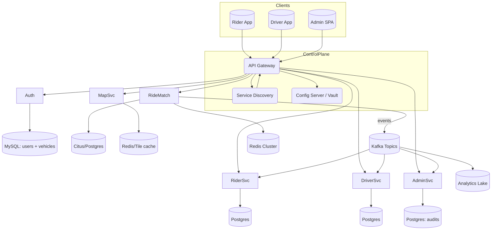

# ViaGO Platform Architecture Guide

This document now breaks the plan into self-contained sections so each team knows what exists today, what must be delivered next, and how everything fits together.

---

## 1. Current Implementation Snapshot
| Area | Status | Notes | Immediate Improvements |
|------|--------|-------|------------------------|
| Auth Service (`viago-auth`) | ✅ Live | Handles signup/login (ADMIN/RIDER/DRIVER), driver vehicle persistence, JWT issuance. | Add soft-delete + audit columns, refresh tokens, stronger validation, externalized secrets. |
| Database | ✅ Live | Single schema with `user_entity` + `vehicles`. | Add indexes on `role`, `email`, `registration_number`; introduce `status` column for deactivation. |
| Seed Data | ✅ Live | `@PostConstruct` inserts 90 demo users across roles. | Move to migration/fixture script to avoid prod side effects. |
| Google OAuth | 🔄 Bootstrapped | Handlers/classes present but flow not wired. | Finish OAuth client config + redirect endpoints. |
| Admin/Rider/Driver/Matching services | ❌ Not implemented | Planned microservices. | Define contracts & repos (see sections below). |
| Platform plumbing (Gateway, Discovery, Kafka, Redis) | ❌ Not implemented | | Stand up infra early so new services plug in consistently. |

---

## 2. Target Platform Overview
ViaGO will operate as a Zero-Trust microservice mesh fronted by an API Gateway, with all downstream traffic authenticated via JWT or mTLS. Services communicate over REST/gRPC with discovery-based load balancing and publish events on Kafka for loose coupling.



---

## 3. Service-Specific Plans
Each service has its own roadmap. Rows show **Today → Next → Later** deliverables.

### 3.1 Auth Service (Owner: Platform Team)
| Stage | Scope |
|-------|-------|
| Today | Signup/login, driver vehicle registration, JWT issuance, seed data. |
| Next  | Refresh tokens, Google OAuth completion, soft-delete + audit tables, internal `/internal/users` APIs for admin. |
| Later | MFA, session revocation, device trust list, distributed cache for login throttling. |

### 3.2 Admin Service (Owner: Admin Team)
| Stage | Scope |
|-------|-------|
| Today | Not built. |
| Next  | React SPA + Spring Boot APIs; consumes Auth internal endpoints with client-credential tokens; CRUD on users & vehicles; moderation queue. |
| Later | Workflow engine (approvals, escalations), bulk actions, metrics dashboards, integration with analytics warehouse. |

### 3.3 Rider Service
| Stage | Scope |
|-------|-------|
| Today | Not built. |
| Next  | Rider profile CRUD, saved places, payment tokenization hooks, history endpoints. |
| Later | Loyalty tiers, offers service integration, GraphQL aggregation for mobile app. |

### 3.4 Driver Service
| Stage | Scope |
|-------|-------|
| Today | Not built (auth stores minimal driver data). |
| Next  | Availability toggle, location heartbeat ingestion, document/KYC uploads, payout preferences. |
| Later | Earnings analytics, compliance reporting, driver coaching modules. |

### 3.5 Ride Matching Service
| Stage | Scope |
|-------|-------|
| Today | Not built. |
| Next  | Event-driven pipeline: `ride.requested` → candidate drivers (Redis cache) → assign → `ride.assigned`; persists trip state. |
| Later | ML-based scoring, pooled rides, ETA prediction, surge integration. |

### 3.6 Map & Geo Service
| Stage | Scope |
|-------|-------|
| Today | Not built. |
| Next  | Proxy to Mapbox/OSRM, caching of distance matrices, geocoding endpoints for internal services. |
| Later | Geo-fencing, heatmap calculations, offline tile packs, route anomaly detection. |

### 3.7 Shared Services (Notifications, Payments, Analytics)
| Service | Status | Plan |
|---------|--------|------|
| Notification | Not built | Provide SMS/push/email wrappers; subscribe to ride & auth events; fallback logic. |
| Payment & Wallet | Not built | Integrate PSP (Stripe/Adyen), manage holds/captures, driver payouts, ledger. |
| Analytics & Reporting | Not built | Kafka consumers populating warehouse + dashboards for ops. |

---

## 4. Platform Foundation Plans
| Component | Purpose | Action Plan |
|-----------|---------|-------------|
| API Gateway | Security, traffic management, routing. | Implement Spring Cloud Gateway; enable JWT filter validated against auth’s public keys; add rate limits per route; configure Canary deployments. |
| Service Discovery | Dynamic routing & health. | Deploy Eureka cluster (3 nodes) behind internal load balancer; services register via Spring Cloud Netflix. |
| Config & Secrets | Centralized config. | Use Spring Cloud Config for non-secret props; HashiCorp Vault / AWS Secrets Manager for credentials; mount via sidecars. |
| Messaging | Async coordination. | Stand up Kafka with topics: `user.*`, `ride.*`, `payment.*`; provide schema registry for contracts. |
| Caching | Low latency lookups. | Redis cluster for sessions, surge multipliers, driver availability. |
| Observability | Monitoring & tracing. | Prometheus + Grafana dashboards, Loki/ELK for logs, OpenTelemetry collector for traces. |
| CI/CD | Delivery pipeline. | GitHub Actions building Docker images, security scans, Helm deploy via ArgoCD. |

---

## 5. Data Architecture
| Store | Owner | Contents | Notes |
|-------|-------|----------|-------|
| `viago_auth` (MySQL) | Auth Service | Users, roles, vehicles, OAuth tokens. | Currently the only DB in use. Needs migration to Flyway and backups. |
| `viago_admin` (Postgres) | Admin Service | Audit logs, cases, manual adjustments. | Created once admin service lands. |
| `viago_rider` (Postgres) | Rider Service | Profiles, payment tokens, history (FK -> auth users). | Sensitive data—partition per geography. |
| `viago_driver` (Postgres) | Driver Service | Documents, earnings, availability, compliance. | Encrypt docs at rest (S3 + KMS). |
| `viago_trip` (Citus/Postgres or Cockroach) | Ride Matching | Trips, legs, fares, telemetry. | Horizontal scale & time-series partitioning. |
| Redis Cluster | Shared | Sessions, surge, driver cache. | TTL-managed; sentinel or managed Redis. |
| Kafka | Shared | Domain events. | Schema-first (Avro/Protobuf) to prevent breaking changes. |
| Analytics Lake | Analytics | Event streams, aggregated metrics. | Could be BigQuery/Redshift; fed via Kafka connectors. |

---

## 6. Interaction Blueprints
### 6.1 Authentication Flow
1. Client → Gateway `/auth/signup` or `/auth/login`.
2. Gateway validates basic schema, forwards to Auth via discovery.
3. Auth persists user/vehicle, issues JWT/refresh pair, emits `user.created` event.
4. Admin & Rider services consume events to maintain read models.

### 6.2 Ride Request Flow (future)
1. Rider App → Gateway `/rides/request`. Gateway authenticates rider JWT.
2. Rider Service validates payment method, publishes `ride.requested` to Kafka.
3. Ride Matching consumes event, queries Redis for nearby drivers from Driver Service heartbeats, calls Map Service for ETA.
4. When driver selected, Ride Matching persists trip, publishes `ride.assigned`, triggers notification service for push/SMS.
5. Driver App acknowledges via Driver Service; updates location periodically to Ride Matching/Redis.

### 6.3 Admin Escalation Flow (future)
1. Admin SPA authenticates through Auth (OAuth2 Authorization Code).
2. SPA calls Admin Service; tokens verified by Gateway.
3. Admin Service fetches authoritative user data from Auth `/internal/users/{id}` (client credentials).
4. Resolution outcome published to Kafka `admin.case.closed` for analytics. 

---

## 7. Deployment & Operations Playbook
1. **Repository Layout**
   ```
   ViaGO/
    ├─ api-gateway/
    ├─ discovery/
    ├─ services/
    │   ├─ viago-auth/
    │   ├─ viago-admin/
    │   ├─ viago-rider/
    │   ├─ viago-driver/
    │   ├─ ride-matching/
    │   └─ map-service/
    ├─ shared/
    │   ├─ contracts/   # DTOs, Avro schemas
    │   └─ helm/        # shared Helm library
    └─ docs/
        └─ plans/
           └─ viago-msa-architecture.md
   ```
2. **Containerization**: Multi-stage Docker builds (Temurin JRE). Publish to GHCR/ECR. 
3. **Kubernetes**: Helm charts per service, Istio or Linkerd optional for mTLS. Use Horizontal Pod Autoscaler + PodDisruptionBudget.
4. **Secrets**: Mounted from Vault/Secrets Manager; rotate quarterly.
5. **CI/CD**: GitHub Actions → build/test/scan → push image → ArgoCD sync to clusters (staging/prod). Include contract tests for Admin↔Auth.
6. **Observability**: KPIs (auth latency, login error rate, ride matching assign latency). Alerts via PagerDuty.
7. **Disaster Recovery**: Automated DB backups + PITR, Kafka cluster replication, runbooks for region failover.

---

## 8. Enhancement Backlog
- Surge Pricing Engine consuming ride density metrics.
- Fraud/Risk scoring (device fingerprinting, behavioral ML).
- Document Management Service (virus scan, manual review tools).
- Feature Flag platform to ship experimental ride flows safely.
- Offline-friendly mobile sync service or GraphQL façade.

---

## 9. Production Readiness Checklist
- [ ] Secrets centralized (Vault/KMS) and rotated.  
- [ ] Flyway/Liquibase migrations for all schemas.  
- [ ] API Gateway + Service Discovery deployed and integrated.  
- [ ] Kafka topics + schema registry provisioned.  
- [ ] Observability stack (metrics/logs/traces) live with SLO dashboards.  
- [ ] Chaos & failover drills run for Ride Matching + Auth.  
- [ ] Incident response runbooks documented.  

---
**Next Step**: stand up the platform foundation (Gateway, Discovery, Kafka, Redis) in staging while the Admin and Rider services are scaffolded against the contracts above. This keeps the Uber-style clone on track for the next project phase.

